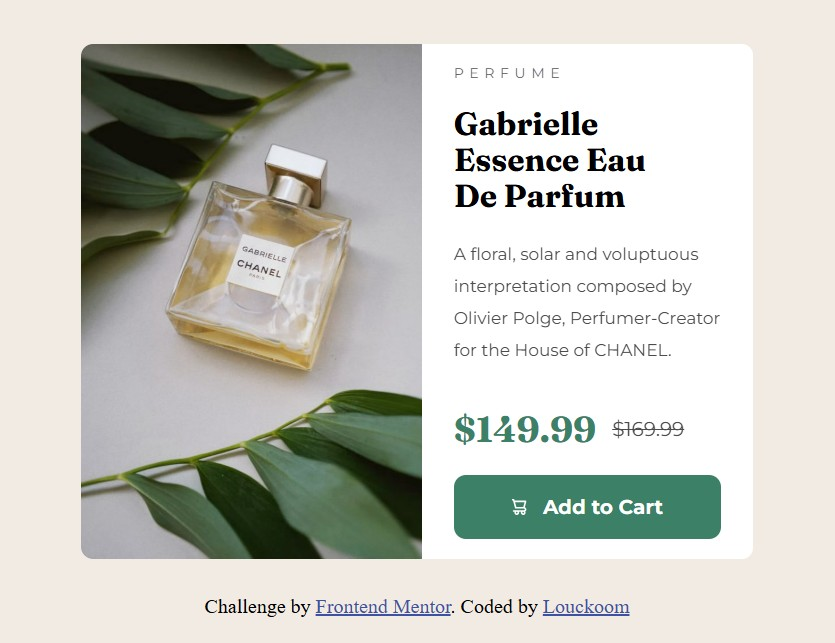

# Frontend Mentor - Product preview card component solution

This is a solution to the [Product preview card component challenge on Frontend Mentor](https://www.frontendmentor.io/challenges/product-preview-card-component-GO7UmttRfa). Frontend Mentor challenges help you improve your coding skills by building realistic projects. 

## Table of contents

- [Overview](#overview)
  - [The challenge](#the-challenge)
  - [Screenshot](#screenshot)
  - [Links](#links)
- [My process](#my-process)
  - [Built with](#built-with)
  - [What I learned](#what-i-learned)
  - [Continued development](#continued-development)
  - [Useful resources](#useful-resources)
- [Author](#author)
- [Acknowledgments](#acknowledgments)

## Overview

### The challenge

The challenge is to build out this product preview card component and get it looking as close to the design as possible.

Users should be able to:

- View the optimal layout depending on their device's screen size
- See hover and focus states for interactive elements

### Screenshot

### Links

- Solution URL: [https://github.com/Louckoom/Product_preview_card]
- Live Site URL: [https://louckoom.github.io/Product_preview_card/]

## My process

- Begin with semantic HTML.
- Import fonts.
- Create CSS link on HTML.
- Install Sass to write using SCSS.
- Write the mobile version of styling using SCSS.
- Adapt for desktop version using media query.
- Adjust some padding and spacing issues.

### Built with

- Semantic HTML5 markup
- SCSS custom properties
- Variable
- Flexbox
- Mobile-first workflow
- Media Query

### What I learned

- I learnt how to use media query.
- I learnt how to write SCSS file.
- I learnt more about flexbox.

### Continued development

To improve it will be useful to streamline the intermediate media query between 375px and 1440px.

### Useful resources

- [Responsive Web.dev website](https://web.dev/learn/design) - This helped me so much to get my responsive correct.

## Author

- Frontend Mentor - [@Louckoom](https://www.frontendmentor.io/profile/Louckoom)
- Twitch - [@LuckyCiel](https://www.twitch/tv/luckyciel)

## Acknowledgments

Did all by myself.
